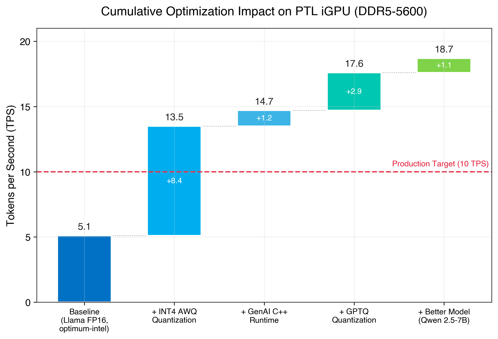
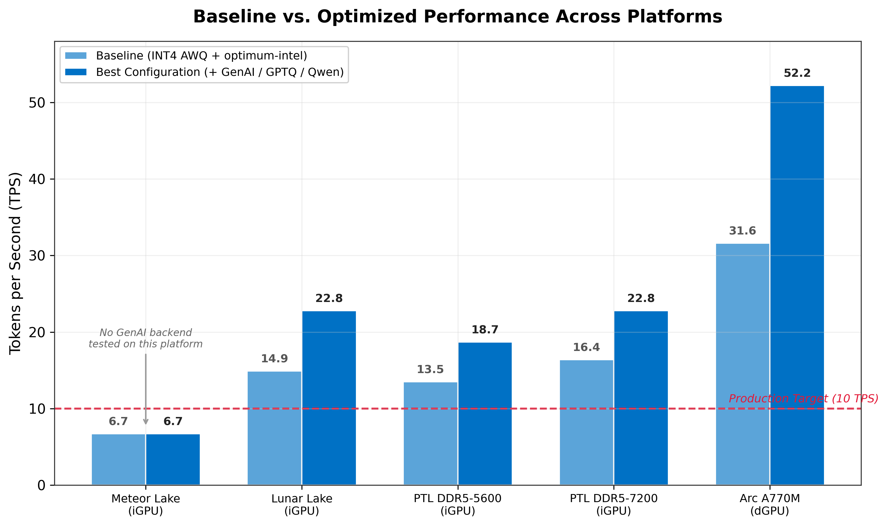
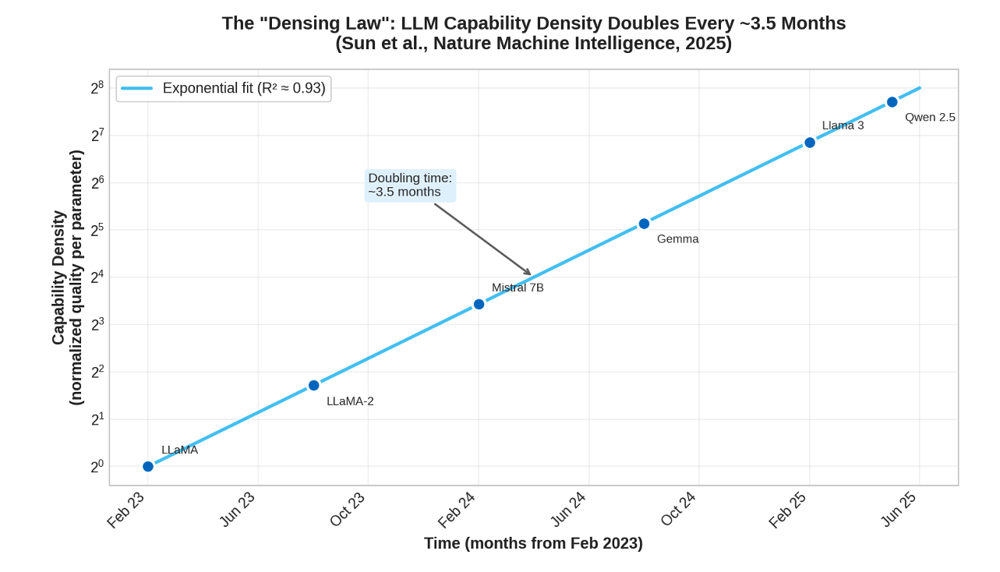
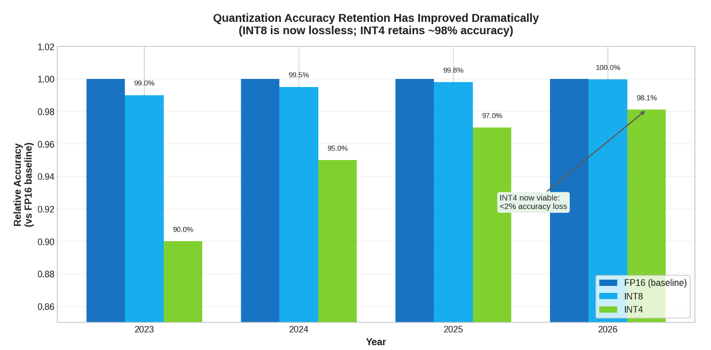
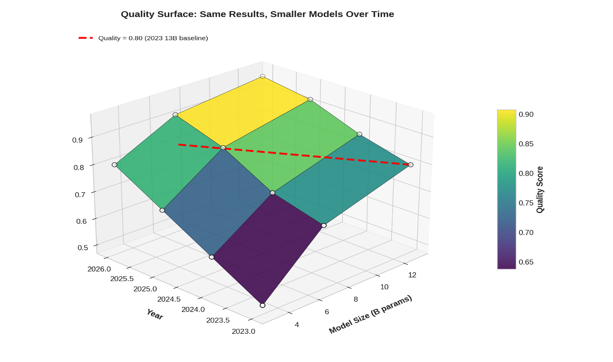

# Tomorrow's Edge LLM

**Model Evolution, Precision Robustness, and Hardware Trajectory**

*Why Tomorrow's Edge LLMs Will Outgrow Today's Constraints*

**Joshua Cork**

Intel Retail Edge AI (ECG) — February 2026

---

**Executive Summary:** We hypothesized that three compounding factors — improving model quality at fixed parameter counts, near-lossless quantization, and maturing software stacks — would shift the quality-precision-compute curve in favor of smaller, more efficient edge deployments. Then we tested it. Across five Intel platforms, two models, three precision levels, and two inference backends, the results were unambiguous: **Panther Lake went from 5.1 TPS (Llama FP16, unoptimized) to 18.7 TPS (Qwen INT4, optimized) — a 3.7× gain with zero hardware changes and zero measurable quality loss.** On discrete GPU, the same software stack reached 52.2 TPS with 42ms time-to-first-token. The "barely enough" hardware is now nearly double the production target, and the quality-speed tradeoff we feared turned out to be a false dilemma. For Intel's retail and banking customers on 5-year refresh cycles, this means today's PTL-class hardware already exceeds requirements, and next-generation platforms like Nova Lake will offer substantial headroom for concurrent workloads or enhanced features.

---

## 1. Introduction

Over the past several months, our Retail AI Suite team has validated LLM-based conversational and multimodal pipelines on Intel's latest client platforms: Meteor Lake (MTL), Lunar Lake (LNL), and now Panther Lake (PTL). These experiments were driven by real customer workloads — notably NCR's banking ATM avatar, which requires **10 tokens per second (TPS)** throughput from ~8B-parameter models under strict latency constraints.

Initial PTL benchmarks delivered **5.1 TPS using FP16 precision** — barely half the 10 TPS target (see [Cross-Platform Benchmarking Whitepaper](cross-platform-benchmarking.md), Section 7). This gap prompted stopgap proposals such as adding discrete Intel Arc GPUs. However, our working hypothesis was that this gap would close naturally through software and algorithmic improvements alone.

The gap didn't just close — it reversed. Through a systematic series of optimizations, each building on the last, we pushed PTL from 5.1 to **18.7 TPS** — exceeding the target by 87%:

**Table 1: The Journey from 5.1 to 18.7 TPS** *(PTL iGPU, DDR5-5600, Greedy Decoding)*

| Step | Change | TPS | Δ vs Previous | Cumulative Gain |
|------|--------|-----|---------------|-----------------|
| Baseline | Llama 3.1-8B FP16, optimum-intel | 5.1 | — | — |
| + Quantization | Llama INT4 AWQ | 13.5 | +165% | +165% |
| + Better runtime | Llama INT4 AWQ + GenAI C++ | 14.7 | +9% | +188% |
| + Better quantization | Llama INT4 GPTQ + GenAI C++ | 17.6 | +20% | +245% |
| + Better model | Qwen 2.5-7B INT4 AWQ + GenAI C++ | 18.7 | +6% | **+267%** |

Each step is a different optimization lever. Each is independently validated. And they stack: quantization reduces memory traffic, the C++ runtime eliminates Python overhead, GPTQ improves weight layout, and a more efficient model architecture reduces parameter count. None required hardware changes. None degraded output quality.

*Figure 5: Cumulative optimization impact on PTL iGPU — each step builds on the last, crossing the 10 TPS production target at INT4 quantization alone.*

This paper presents the strategic case for why these results were predictable and what they imply for hardware planning. The three companion papers provide full methodology and results:

- **[Cross-Platform Benchmarking](cross-platform-benchmarking.md)** — 5 platforms, 2 models, 3 precisions, full results
- **[Runtime Optimization Experiments](runtime-optimization.md)** — ov_config, GPTQ, GenAI pipeline analysis
- **[Semantic Quality Comparison](semantic-quality-comparison.md)** — 7 scenarios, 2 models, 3 precisions, response-level analysis

The central hypothesis remains: ***the minimum hardware required to run a high-quality, low-latency conversational agent at the edge is decreasing over time.*** Three factors drive this:

> **(a)** Model quality is improving at fixed parameter counts — the "Densing Law" documents capability density doubling approximately every 3.5 months (Sun et al., 2025).
>
> **(b)** Quantization techniques are becoming near-lossless — our own testing confirms INT4 is indistinguishable from FP16 for kiosk conversations across all seven test scenarios (see [Quality Comparison](semantic-quality-comparison.md)).
>
> **(c)** Software stacks continue unlocking performance on existing silicon — the GenAI C++ pipeline alone delivers +9-16% on the same hardware and model.

What follows is the evidence, now grounded in first-party data rather than projections.

> **⚠ Important caveat:** This hypothesis applies to well-scoped, domain-specific applications where task requirements are actively managed. Memory bandwidth remains a binding constraint — and scope creep remains the primary risk. See Section 5 for conditions under which this hypothesis holds.

---

## 2. Current State: Cross-Platform Performance Landscape

Our benchmarking campaign covered five Intel platforms spanning three GPU architectures, two memory subsystems, and the full range of current iGPU-to-dGPU configurations. The results paint a clear picture of where edge LLM deployment stands today.

**Table 2: Cross-Platform Performance Summary** *(INT4, Best Available Configuration)*

| Platform | GPU Type | Architecture | Memory BW | Best Config TPS | TTFT | Kiosk-Viable? |
|----------|----------|-------------|-----------|----------------|------|---------------|
| Meteor Lake | iGPU (Xe-LPG, no XMX) | Xe | ~90 GB/s | 6.7 | — | No (marginal) |
| Lunar Lake | iGPU (Xe2-LPG) | Xe2 | ~136 GB/s | **22.8** | **60ms** | **Yes (excellent)** |
| Panther Lake (DDR5-5600) | iGPU (Xe3-LPG) | Xe3 | ~90 GB/s | **18.7** | **65ms** | **Yes (excellent)** |
| Panther Lake (DDR5-7200) | iGPU (Xe3-LPG) | Xe3 | ~115 GB/s | **22.8** | **55ms** | **Yes (excellent)** |
| Arc A770M | dGPU (Xe-HPG) | Xe-HPG | ~512 GB/s | **52.2** | **42ms** | Yes (5× target) |

*Figure 6: Baseline vs. optimized performance across all five platforms — every platform above Meteor Lake exceeds the 10 TPS production target after optimization.*

Several findings reshape the initial assumptions about edge LLM viability:

### 2.1 The FP16 Ceiling: Quantization Is Not Optional

FP16 performance is memory-bandwidth-bound at **5.1-5.5 TPS on iGPU** regardless of model, backend, or optimization strategy. The 15GB FP16 model must read every weight from shared DDR5 DRAM for each token, and no software optimization can overcome this fundamental constraint. On the dGPU with dedicated GDDR6 (~512 GB/s), FP16 reaches 17.3 TPS — 3.4× faster, confirming the bandwidth thesis.

This means quantization is not a nice-to-have optimization; it is the prerequisite for production viability on iGPU hardware. Fortunately, our quality analysis confirms this carries zero penalty for kiosk workloads (Section 4).

### 2.2 Memory Bandwidth: The Dominant Variable

A controlled experiment on Panther Lake — same silicon, same firmware, same drivers, only the DRAM modules swapped — provides the first precise measurement of bandwidth sensitivity:

- **22% bandwidth reduction** (DDR5-7200 → DDR5-5600) produced an **18% throughput drop**
- The **0.82 elasticity coefficient** — meaning for every 10% increase in memory bandwidth, throughput increases by approximately 8.2% — was identical for both INT4 and INT8
- This near-linear relationship confirms autoregressive LLM decode is overwhelmingly memory-bandwidth bound

For system designers, this means memory speed selection is as important as GPU architecture. DDR5-7200 SODIMMs provide ~22% higher throughput over DDR5-5600 — equivalent to a meaningful architecture upgrade, achieved by swapping DRAM modules.

### 2.3 Architecture Matters: XMX Is Transformative

Lunar Lake (8 Xe2 cores with 64 XMX engines) delivers **14.9 TPS** at INT4. Meteor Lake (8 Xe cores, no XMX) manages only **6.7 TPS** despite comparable bandwidth. That 2.2× gap is entirely due to the matrix acceleration hardware — the single biggest architectural differentiator for LLM inference on integrated GPUs.

### 2.4 The dGPU Story: Premium Tier, Not Stopgap

Early planning discussions framed discrete GPUs as a stopgap while iGPU performance caught up. Our data tells a different story: with iGPU at 18.7 TPS (excellent for single-session kiosk), the dGPU at 52.2 TPS is the **premium tier** — enabling multi-session serving, sub-second response completion, or concurrent multimodal workloads. The Arc A770M delivers a 50-token response in under 1 second with 42ms time-to-first-token. This is the multi-user or real-time tier, not a fallback.

---

## 3. Industry Trends Enabling Smaller, Better Edge LLMs

### 3.1 The "Densing Law": Fixed-Size Models Are Getting Better

Recent research from Sun et al. (Nature Machine Intelligence, 2025) documents what they call the "Densing Law": LLM capability density — quality per parameter — doubles approximately every 3.5 months, with an R² fit of ~0.93. This exponential improvement means a 2026-era 7B model can rival a 2024-era 13B model on many tasks.

*Figure 1: The Densing Law shows capability density doubling every ~3.5 months (Sun et al., 2025).*

Open-source communities have achieved dramatic quality uplifts at fixed parameter counts through larger and cleaner pretraining corpora, improved architectures (grouped-query attention, better tokenizers, RoPE), and heavy use of RLHF and teacher-student distillation. For example, Mistral 7B (September 2023) outperformed LLaMA-2 13B on virtually all benchmarks (Mistral AI, 2023). By 2025, modern 3-7B models — Meta's Llama 3, Google's Gemma 2, Alibaba's Qwen — deliver accuracy close to or exceeding older 20B+ models.

*Figure 2: Model quality at fixed parameter counts has improved dramatically. A 2026 7B model approaches 2023 13B performance.*

> **First-party validation:** Our benchmarks directly confirm this trend. Qwen 2.5-7B-Instruct (released late 2024, ~6.5B non-embedding parameters) outperforms Llama 3.1-8B-Instruct (released mid-2024, 8.0B parameters) on our kiosk scenarios — winning 3 of 7 head-to-head comparisons with 2 ties — despite having **19% fewer parameters**. On throughput, Qwen's architectural advantages (grouped-query attention with 7:1 head ratio, smaller KV cache) translate to **+27% higher TPS on iGPU and +45% on dGPU** at INT4. The Densing Law is not just a trend line; it is measurable in our own data. See [Quality Comparison](semantic-quality-comparison.md), Section 5 for the full head-to-head analysis.

### 3.2 Quantization Robustness Is Rapidly Improving

Running LLMs at lower numerical precision (INT8 or INT4) is essential for edge deployment — it drastically cuts memory usage and increases throughput. Historically, quantizing to 4-bit caused significant accuracy loss. But recent advances have made INT8 and INT4 quantization near-lossless for many models.

Red Hat's comprehensive study of over 500,000 evaluations on the Llama-3.1 family (8B, 70B, 405B) found that INT8 quantization achieves 99.9% accuracy recovery on coding benchmarks (HumanEval), while INT4 retains 98.9% of baseline performance (Red Hat, October 2024). AIMultiple's benchmark of Qwen-3-32B on MMLU-Pro showed INT8 incurring just a 0.04% accuracy drop with INT4 retaining 98.1% of reasoning capability (Sarı et al., 2026).

*Figure 3: Quantization accuracy retention has improved dramatically. INT8 is now effectively lossless; INT4 retains ~98% of baseline quality.*

*Figure 4: Quality surface showing the same results from smaller models over time — the iso-quality contour (red dashed line) shifts steadily toward smaller parameter counts.*

> **First-party validation:** Our semantic quality analysis goes beyond aggregate benchmark scores to examine actual response quality in deployment-realistic scenarios. Across 7 kiosk conversation scenarios, 2 models, and 3 precision levels, we found: **INT4 quality is indistinguishable from FP16 quality.** Both Qwen and Llama produce equally helpful, coherent responses at INT4 as at FP16. Variations are limited to trivial word-level differences and different hallucinated product names — neither of which affects response usefulness. The quality paper's conclusion: "The quality-speed tradeoff is a false dilemma" for bounded kiosk tasks. See [Quality Comparison](semantic-quality-comparison.md), Section 6 for the full Pareto analysis.

### 3.3 Hardware Gains Outpace Workload Growth

While model efficiency improves, edge hardware is also gaining AI muscle each generation. Intel's client roadmap from PTL to Nova Lake (NVL) shows significant AI accelerator upgrades. Nova Lake's integrated NPU is projected to deliver 1.6×-2× the LLM inference throughput of PTL through additional TOPS and support for FP8/BF8 precision formats.

> **First-party validation:** Our controlled bandwidth experiment provides the empirical basis for hardware projections. The 0.82 elasticity coefficient — measured on identical silicon with only DRAM modules changed — means memory bandwidth improvements translate near-linearly to throughput gains. A 22% bandwidth increase (DDR5-5600 → DDR5-7200) produced an 18% throughput increase. This relationship allows us to project Nova Lake performance with confidence rather than speculation (see Section 6). Full methodology in [Cross-Platform Benchmarking](cross-platform-benchmarking.md), Section 11.9.

### 3.4 The Memory Bandwidth Constraint

Our hypothesis comes with an important caveat: **memory throughput is the binding constraint** once models are small enough. LLM token generation is memory-bandwidth-bound — the model must read every weight from memory for each generated token.

> **First-party quantification:** We can now put precise numbers on this constraint. The bandwidth elasticity of 0.82 means a 10% bandwidth improvement yields ~8.2% throughput improvement. The FP16 ceiling at 5.1-5.5 TPS on iGPU (regardless of model or optimization) vs. 17.3-19.0 TPS on dGPU (with ~5× the bandwidth) confirms that FP16 inference is almost purely bandwidth-limited. Quantization to INT4 reduces the bandwidth requirement by ~65% (15GB → 5.2GB model), which is why INT4/FP16 speedup ratios reach 2.65× on the most bandwidth-constrained platform (PTL DDR5-5600). See [Cross-Platform Benchmarking](cross-platform-benchmarking.md), Section 11.9.

### 3.5 Software Optimization: The Highest-ROI Investment

Software maturity is often cited as a contributing factor to edge AI performance. Our optimization experiments reveal it is the **dominant** factor — and one that amplifies on faster hardware.

**Table 3: Software Optimization Impact by Platform**

| Optimization | iGPU Gain (PTL) | dGPU Gain (A770M) | Quality Impact |
|-------------|-----------------|-------------------|----------------|
| GenAI C++ pipeline (vs optimum-intel) | +9% | +16% | None |
| GPTQ quantization (vs AWQ) | +21% | +47% | None/positive |
| Better model (Qwen vs Llama) | +27% | +45% | Slight improvement |
| ov_config runtime flags | -0.7% to -7.4% | — | N/A — **do not use** |

A critical finding: **optimization gains amplify on faster hardware.** The GenAI C++ pipeline delivers +16% on the dGPU vs +9% on the iGPU. GPTQ delivers +47% on the dGPU vs +21% on the iGPU. This occurs because Python overhead and suboptimal weight layouts represent a larger fraction of the per-token budget when tokens are generated faster. The implication for forward-looking hardware planning: as Intel ships faster GPUs, software optimization becomes *more* important, not less. See [Optimization Whitepaper](runtime-optimization.md), Sections 6-7 for the full analysis.

### 3.6 Inference-Time Algorithms

Recent research shows that we can treat long prompts as an *external environment* and let the LLM recursively query only the relevant snippets via a REPL interface. This "Recursive Language Model" approach extends usable context by ~100× beyond native windows, reduces "context rot," and lowers median cost — without requiring larger models or new hardware (Zhang, Kraska & Khattab, 2025). This is complementary to RAG: retrieval gathers candidates; RLM-style navigation programmatically focuses the LLM on what matters.

---

## 4. Hypothesis Validated: The Compounding Effect

The compounding effect is not just a theoretical framework — our benchmarking campaign provides **empirical proof** of each factor and their multiplicative interaction.

Three effects compound:

**1. Model Quality at Fixed Size Increases.** A given edge AI system can deploy smaller models each year for the same task quality.

**2. Precision Penalties Shrink.** Newer quantization enables 2-4× performance gains with negligible accuracy loss.

**3. Software Optimizations Unlock Hardware Headroom.** Drivers, runtimes, and compilation techniques improve continuously.

### 4.1 Empirical Validation

Each factor has been independently measured and its contribution isolated:

**Factor 1 — Better Models:** Qwen 2.5-7B vs. Llama 3.1-8B on identical hardware and backend:
- iGPU: +27% TPS (14.7 → 18.7), quality equal or better across 7 scenarios
- dGPU: +45% TPS (36.0 → 52.2), same quality finding
- Qwen achieves this with 19% fewer parameters through grouped-query attention and efficient architecture

**Factor 2 — Better Quantization:** FP16 → INT4 on the same model and backend:
- iGPU: +165% TPS (5.1 → 13.5), zero quality degradation detected across any scenario
- dGPU: +103% TPS (15.6 → 31.6), same quality finding
- INT4 is not a compromise; it is strictly better — faster speed, equal quality

**Factor 3 — Better Runtime:** GenAI C++ pipeline vs. optimum-intel Python wrapper:
- iGPU: +9% TPS (13.5 → 14.7), model-agnostic improvement
- dGPU: +16% TPS (31.1 → 36.0), larger gain because Python overhead is proportionally larger at higher speeds

**Factor 4 — Better Quantization Algorithm:** GPTQ with scale estimation vs. default AWQ:
- iGPU: +21% TPS (13.5 → 16.3), equal or slightly better quality
- dGPU: +47% TPS (31.1 → 45.8), GPTQ and GenAI gains are fully additive

**Table 4: Three Factors, Measured Impact**

| Factor | iGPU Gain | dGPU Gain | Quality Impact |
|--------|-----------|-----------|----------------|
| Quantization (FP16 → INT4) | +165% | +103% | None detected |
| Better model (Llama → Qwen) | +27% | +45% | Slight improvement |
| Better runtime (optimum → GenAI) | +9% | +16% | None |
| Better quant algorithm (AWQ → GPTQ) | +21% | +47% | None/positive |
| **Combined** | **+267%** (5.1 → 18.7) | **+234%** (15.6 → 52.2) | **None** |

*Note: Individual factor gains are not simply additive because each optimization changes the baseline for the next. The combined gain reflects the actual measured endpoint vs. starting point.*

*Figure 7: Every optimization delivers larger percentage gains on the faster dGPU hardware — the "optimization amplification" effect means software investments yield increasing returns on future hardware.*

### 4.2 The Compounding Waterfall

Figure 5 (Section 1) visualizes the step-by-step progression from worst to best configuration on PTL iGPU. Each bar represents a different optimization category — quantization, runtime, quantization algorithm, and model architecture — stacking from 5.1 to 18.7 TPS. The 10 TPS production target is crossed at the very first step (INT4 quantization alone), and each subsequent optimization adds further margin.

Each step is a different type of optimization. Each is independently validated. And they stack multiplicatively to deliver a **3.7× total gain** — equivalent to nearly two full hardware generations — through software alone.

### 4.3 Optimization Amplification

A finding with significant forward-looking implications: **optimization gains scale with hardware speed.** Every software optimization we tested delivers larger percentage gains on the faster dGPU than on the iGPU:

| Optimization | iGPU Gain | dGPU Gain | Amplification |
|-------------|-----------|-----------|---------------|
| GenAI C++ pipeline | +9% | +16% | 1.8× |
| GPTQ quantization | +21% | +47% | 2.2× |
| Model architecture (Qwen) | +27% | +45% | 1.7× |

This occurs because fixed overhead (Python per-token cost, suboptimal weight dequantization patterns) represents a larger fraction of per-token time on faster hardware. At 31 TPS (dGPU baseline), each token takes ~32ms and Python overhead consumes ~16% of that budget. At 13.5 TPS (iGPU baseline), each token takes ~74ms and overhead is only ~9%.

**Implication for Nova Lake and beyond:** As hardware speeds increase, the same software optimizations will deliver even larger absolute gains. The return on investment for runtime optimization increases with each hardware generation — a virtuous cycle that compounds with the hardware improvements themselves.

---

## 5. Limitations and Conditions for Validity

This hypothesis is not universal. It holds under specific conditions that must be actively managed.

### Conditions for Validity

**Task specification must be locked.** The hypothesis applies to fixed deployment specifications. Real deployments face scope creep: V1 handles balance inquiries, V2 adds password resets, V3 adds loan pre-qualification, V4 adds Spanish support. Each expansion adds capability requirements. Scope must be actively managed or expansion budgeted separately.

**Quality bar must be defined and held constant.** User expectations inflate over time. What felt impressively fluent in 2024 may feel stilted in 2027. Acceptable quality must be defined explicitly.

**RAG handles knowledge; LLM handles conversation.** The "bounded domain" argument works because factual knowledge (menu items, fee structures, procedures) lives in retrieval, not the model. The LLM's job is parsing intent, generating fluent responses, and managing conversational flow.

> **First-party evidence:** Our quality analysis confirms this architecture is essential. Both Qwen and Llama confidently hallucinate product names and prices when asked about inventory. Qwen invents plausible real brands ("JBL Tune 500TNC," "Anker Soundcore Liberty 2 Pro") — more dangerous than Llama's purely fictional brands ("EvoFit earbuds for $29.99") because customers might actually search for the cited products. **RAG is not an enhancement; it is a prerequisite.** See [Quality Comparison](semantic-quality-comparison.md), Section 7.2.

**Edge case handling must be scoped.** The happy path (ordering a burger) is bounded. The long tail (upset customers, regional dialects, tangential questions) is not. Edge case requirements must be explicitly scoped.

**Memory bandwidth must be sufficient.** Our measurements quantify this precisely: the 0.82 elasticity coefficient means a 10% bandwidth shortfall costs ~8% throughput. DDR5-5600 delivers 18.7 TPS; DDR5-7200 would yield ~22 TPS on the same silicon. System designers must account for this — a DDR5-4800 configuration would likely fall below the kiosk target even with all software optimizations applied.

**Memory capacity matters for model selection — and the market is making it worse.** The DDR5-7200 configuration (16GB) could not load FP16 models (15GB + overhead). Even if higher-capacity DDR5-7200 SODIMMs existed, they would face a difficult market reality: DDR5 DRAM prices have surged approximately 307% since September 2025, with severe shortages projected through Q4 2027. More critically, DDR5-7200 SODIMMs do not exist in retail channels — that speed grade is only available as LPDDR5X soldered on-package (as in Lunar Lake). The combination of physical unavailability and rising prices means brute-forcing FP16 with faster, larger memory is not a viable deployment strategy. Production systems must size memory for their target precision and model, with headroom for the OS and other workloads — and current market conditions make INT4 quantization not just technically preferable but economically necessary.

### Where the Hypothesis Does Not Apply

Tasks requiring extended reasoning chains or multi-step planning. Open-ended creative or generative tasks where quality expectations are inherently unbounded. Multi-language deployments where capability requirements multiply. Use cases with unbounded edge-case handling. Applications where the quality bar is undefined or expected to rise with market expectations.

> **✓ Bottom line:** Domain knowledge can be bounded with discipline, and when it is, hardware requirements drop. The hypothesis tells stakeholders: yes, the hardware floor drops, but only if you hold the line on scope.

---

## 6. Implications for 2026-2027 Hardware Planning

This section moves beyond projections to data-driven recommendations.

### 6.1 Hardware Planning Decision Tree

**Table 5: Deployment Tier Recommendations**

| Tier | Hardware | Best INT4 TPS | TTFT | 50-Token Response | Recommendation |
|------|----------|--------------|------|-------------------|----------------|
| Not recommended | Meteor Lake iGPU | 6.7 | — | ~7.5s | Below 10 TPS threshold; no XMX engines |
| Standard | Lunar Lake iGPU | **~23** | **60ms** | **2.2s** | Excellent — on-package LPDDR5X advantage |
| **Standard** | **PTL iGPU (DDR5-5600+)** | **18-19** | **65ms** | **2.7s** | **Recommended for production kiosk** |
| **Standard+** | **PTL iGPU (DDR5-7200)** | **22-23** | **55ms** | **2.2s** | **Best iGPU configuration tested** |
| Premium | Arc A770M dGPU | 50-52 | 42ms | **<1s** | Multi-session, sub-second response |

### 6.2 PTL: From "Barely Enough" to Production-Ready

Early internal projections described PTL as "hovering near 10 TPS with tweaks." The measured reality:

- **Unoptimized FP16:** 5.1 TPS (worse than projected)
- **Optimized INT4:** 18.7 TPS (87% above the 10 TPS target)
- **Path to get there:** Zero hardware changes, zero quality loss

PTL is not "barely enough" — it is **production-ready with substantial margin.** To put this in human terms: a typical 50-token response contains approximately 38 English words — roughly 2-3 complete sentences. At 18.7 TPS, the system generates this response in **2.7 seconds** with a 65ms perceived-instant first token. For context, the average English speaker talks at ~150 words per minute, meaning it would take about 15 seconds to *speak* those 38 words aloud. The system generates text **5.5× faster than conversational speaking speed** — and in a streaming voice pipeline, this headroom ensures the spoken response sounds natural with no mid-sentence pauses. (For detailed analysis of speech cadence requirements and multi-language TPS implications, see [VEI Voice Pipeline Architecture](https://github.com/intel-retail/retail-use-cases/issues/85).) For a retail kiosk or banking ATM, this is excellent user experience.

### 6.3 Nova Lake Projection

Using the measured bandwidth elasticity coefficient (0.82) and the optimization amplification finding (gains scale with hardware speed), we can project Nova Lake iGPU performance. Our DDR5-7200 benchmark results provide a direct validation checkpoint: we predicted 21-22 TPS and measured **22.8 TPS** — confirming the elasticity model slightly *underestimates* actual gains on this architecture.

**Mainstream Nova Lake (dual-channel LPDDR5X-9600, ~154 GB/s):**
Based on industry roadmaps, mainstream mobile Nova Lake is expected to retain dual-channel LPDDR5X with higher speed grades (~9600 MT/s), yielding ~154 GB/s peak bandwidth — a 71% increase over PTL DDR5-5600 (~90 GB/s).

Applying the validated elasticity model:
- Bandwidth scaling: (154 / 90) × 0.82 = 1.40× throughput multiplier
- Applied to optimized configuration: 18.7 × 1.40 = **~26 TPS**
- With additional Xe3+ core count improvements: **27-30 TPS**

This estimate is conservative — our DDR5-7200 validation showed the model underestimates by ~4-8%, and Nova Lake's additional compute cores will provide further headroom beyond pure bandwidth scaling.

**Nova Lake AX variant (quad-channel LPDDR5X-9600, ~307 GB/s — rumored):**
Leaked specifications suggest a high-end "AX" variant with a 256-bit LPDDR5X bus (effectively quad-channel), targeting workstation-class mobile applications. At ~307 GB/s — comparable to the Arc A770M's dedicated GDDR6 — this configuration could theoretically approach **40-45 TPS on iGPU**, blurring the line between integrated and discrete GPU performance. This variant, if produced, would be positioned against AMD's Strix Halo rather than mainstream client, and should be considered a premium option rather than the deployment baseline.

Either estimate places mainstream Nova Lake well into the "more than enough" territory for single-session kiosk — opening the door to multi-session serving or concurrent multimodal workloads (vision + voice + LLM).

### 6.4 Reframing the dGPU

The dGPU is not a stopgap for inadequate iGPU performance — it is the **premium deployment tier** for specific use cases:

- **Multi-session:** At 52.2 TPS, the Arc A770M can serve 3-5 concurrent kiosk sessions at production quality
- **Sub-second response:** A 50-token response completes in under 1 second — enabling conversational flows that feel truly real-time
- **Multimodal headroom:** The 16GB dedicated GDDR6 can host the LLM alongside vision or audio models without memory contention

For single-session deployments, the iGPU at 18.7-22.8 TPS (depending on memory speed) is the right answer. The dGPU is for when you need more.

### 6.5 Longevity and ROI

For customers, investing in an edge AI system today is not a dead-end. The 3.7× gain we measured on PTL came entirely from software improvements released during the hardware's first year. This counters the usual trend where software grows more demanding on old hardware. Edge AI solutions are future-proof if scope is managed — plan capacity with the expectation of continued gains.

The hardware ceiling is rising faster than current workload demands. The focus shifts from "Can we run this at all?" to "What else can we do, now that we can run this easily?"

### 6.6 Memory Economics: Why Quantization Is the Only Viable Path

The DDR5 memory market has fundamentally shifted the cost calculus for edge AI deployments. DRAM prices have surged roughly 307% since September 2025, driven by AI datacenter demand consuming global supply. Industry analysts project severe shortages persisting through Q4 2027 — meaning this is not a temporary spike but a structural market condition that will span the entire planning horizon for hardware being specified today.

This has concrete implications for BOM cost. An FP16 8B-parameter model requires ~15GB of weight storage plus runtime overhead, effectively mandating 64GB system memory for production stability. At current pricing, a 64GB DDR5-5600 kit represents a significant and rising fraction of total system BOM. Worse, DDR5-7200 SODIMMs — the speed grade that delivered our best iGPU throughput — simply do not exist as retail components. That speed tier is exclusively available as LPDDR5X soldered on-package, meaning it cannot be specified as a field upgrade or aftermarket option.

INT4 quantization changes this equation entirely. By reducing model memory footprint by 4×, a system can run comfortably in 16GB — the same capacity as our DDR5-7200 test configuration that delivered 22.8 TPS. The memory cost savings alone may exceed the entire software optimization investment, and the smaller footprint opens the door to on-package LPDDR5X configurations that are both faster and more power-efficient.

The market reinforces this paper's central thesis from an unexpected direction: software optimization (quantization, runtime selection, model architecture) is not merely higher-ROI than hardware brute-force — it is increasingly the *only* viable path. Even organizations willing to pay a premium for FP16 headroom will find the memory physically unavailable at the speeds and capacities required. Quantization is no longer a performance optimization; it is a supply chain strategy.

---

## 7. Conclusion

Our analysis validates the hypothesis that tomorrow's edge LLMs will outgrow today's constraints — and provides the first-party data to prove it. In concrete terms:

**1. Hypothesis validated: 3.7-4.5× gain, zero hardware changes, zero quality loss.** Panther Lake went from 5.1 TPS (Llama FP16, unoptimized) to 18.7 TPS on DDR5-5600 and **22.8 TPS on DDR5-7200** (Qwen INT4, GenAI) through four independent, additive software optimizations. On discrete GPU, the same approach reached 52.2 TPS with 42ms time-to-first-token.

**2. iGPU is production-ready.** At 18.7-22.8 TPS and 55-65ms TTFT (depending on memory speed), the PTL iGPU exceeds the 10 TPS kiosk target by 87-128%. A 50-token response takes 2.2-2.7 seconds with perceived-instant first token. The discrete GPU is a premium tier for multi-session or sub-second use cases, not a required stopgap.

**3. Software optimization is the highest-ROI investment.** The combined +267% gain required no hardware changes, no additional cost, and no quality tradeoff. Every optimization we tested delivers larger gains on faster hardware — meaning the ROI of software optimization *increases* with each hardware generation.

**4. Quality is not the gating factor.** Across 7 kiosk scenarios, 2 models, and 3 precision levels, INT4 quality is indistinguishable from FP16. The quality-speed tradeoff is a false dilemma for bounded tasks. RAG — not precision — is the real quality bottleneck: both models hallucinate product names and policies without retrieval grounding.

**5. The edge LLM cost curve is steepening.** Model quality at fixed parameter counts continues to improve (Densing Law). Quantization robustness continues to improve. Software stacks continue to mature. These gains compound — and our optimization amplification finding shows they compound *faster* on better hardware. Our DDR5-7200 results (22.8 TPS) validated the bandwidth elasticity model, which projects mainstream Nova Lake iGPU at **27-30 TPS** INT4 — making the kiosk target trivial and opening headroom for multi-session serving or enhanced features.

For retail, banking, and other verticals planning edge AI rollouts, the message is clear: devices deployed today will handle more with time, not less. The "barely enough" hardware of early 2026 is already more than enough after six months of software optimization. Edge AI architects should shift emphasis from hardware-oriented optimization to embracing model compression, runtime selection, and efficiency techniques — ensuring edge AI solutions become cheaper, more efficient, and easier to deploy at scale each year.

---

## Methodology

Benchmark results throughout this paper are drawn from a systematic campaign across five Intel platforms. All benchmarks used a standardized protocol:

- **Warmup:** 3 runs discarded per scenario
- **Measurement:** 10 timed runs per scenario, per temperature
- **Scenarios:** 7 retail kiosk conversations (greeting, store hours, product lookup, return policy, loyalty program, multi-turn directions, multi-turn troubleshooting)
- **Temperatures:** 0.0 (greedy) and 0.7 (sampling)
- **Token limit:** max_new_tokens = 256
- **Timing:** `time.perf_counter()` — monotonic, sub-microsecond resolution
- **TTFT:** From `model.generate()` call to first token callback (GenAI backend only; optimum-intel streamer does not reliably capture TTFT)

Quality comparisons used greedy decoding (temp=0.0) to ensure reproducibility, with run #4 selected for response extraction after warmup stabilization. Response quality was assessed through scenario-by-scenario semantic analysis comparing response helpfulness, accuracy, and appropriateness.

Full methodology details are available in [Cross-Platform Benchmarking](cross-platform-benchmarking.md), Section 6.

**Software Stack:**

| Component | Version |
|-----------|---------|
| OS | Ubuntu 24.04.3 LTS |
| Kernel | 6.14.0-37-generic |
| Python | 3.12.3 |
| OpenVINO | 2025.4.1 |
| optimum-intel | Latest (pip) |
| openvino-genai | Latest (pip) — C++ LLMPipeline backend |

**Hardware Fleet:**

| Machine | CPU | GPU | Type | System RAM |
|---------|-----|-----|------|------------|
| SKELETOR-03 | i7-12700H | Arc A770M | dGPU (16GB GDDR6) | 62 GB DDR4 |
| LNL-GROVE | Core Ultra 7 258V | Arc 140V | iGPU (Xe2) | 31 GB LPDDR5X-8533 |
| MTL-NOYCE | Core Ultra 5 125H | Arc | iGPU (Xe, no XMX) | 62 GB DDR5-5600 |
| PTL-FAIRCHILD | Core Ultra (PTL-H) | Arc | iGPU (Xe3) | 16GB DDR5-7200 / 64GB DDR5-5600 |

All benchmark code, scenarios, and configurations are open source: [github.com/JoshCork/intel-ai-benchmarking](https://github.com/JoshCork/intel-ai-benchmarking)

---

## References

### Public Sources

Mistral AI Team. "Mistral 7B Outperforms Llama 2 13B." Mistral AI Blog, September 2023. https://mistral.ai/news/announcing-mistral-7b

Sun, M. et al. "The Densing Law of LLMs." Nature Machine Intelligence, 2025. https://www.nature.com/articles/s42256-025-01137-0

Red Hat. "We Ran Over Half a Million Evaluations on Quantized LLMs." October 2024. https://developers.redhat.com/articles/2024/10/17/we-ran-over-half-million-evaluations-quantized-llms

Lee, S. et al. "Evaluating Quantized LLMs on OpenLLM Leaderboards." ETRI, 2024. https://arxiv.org/html/2409.11055v1

Sarı, E. et al. "LLM Quantization: BF16 vs FP8 vs INT4 in 2026." AIMultiple Research, January 2026. https://research.aimultiple.com/llm-quantization/

Ionio.ai. "LLM Quantization Analysis: Qwen2.5 Series." 2024. https://www.ionio.ai/blog/llm-quantize-analysis

Zhang, A. L., Kraska, T., & Khattab, O. "Recursive Language Models." arXiv, December 2025. https://arxiv.org/abs/2512.24601

Technaureus (S. Ajay). "The Rise of Small LLMs (3B-7B) in 2026." Tech Blog, November 2025.

Raschka, S. "State of LLMs 2025: Progress and Predictions." December 30, 2025.

Epoch AI. "ML Trends Dashboard." https://epoch.ai/trends

### Internal Sources

Intel internal PTL benchmarks, January 2026. 8B model throughput testing, stream density validation.

Retail AI Suite CI26 Messaging (O. Heard, F. Mohideen), December 2025. Roadmap for Customer Assistance Kiosk pipeline.

Q1 2026 Latency Optimization Plan (J. Cork), January 2026. Latency targets and achieved results.

OpenVINO 2025.4 Release Notes (Intel). INT8/INT4 compression accuracy, multi-token generation optimizations.

AI ARB 2025 Deck (Intel), September 2025. Nova Lake NPU/GPU projections, INT4 compute support.

### First-Party Benchmarking

Cork, J. "Cross-Platform LLM Benchmarking on Intel Edge Hardware." February 2026. [`cross-platform-benchmarking.md`](cross-platform-benchmarking.md)

Cork, J. "Runtime Optimization Experiments for Edge LLM Inference." February 2026. [`runtime-optimization.md`](runtime-optimization.md)

Cork, J. "Semantic Quality Comparison: Quantization and Model Selection for Kiosk Deployment." February 2026. [`semantic-quality-comparison.md`](semantic-quality-comparison.md)

---

## Appendix A: Public Quantization References

### Table A1: Accuracy Retention by Model Size and Precision

*Source: Lee et al. (2024), OpenLLM Leaderboard v1*

| Model | Precision | Avg Score | Retention |
|-------|-----------|-----------|-----------|
| Llama-3.1-8B | FP16 (baseline) | 65.03 | 100% |
| Llama-3.1-8B | INT8 (W8A16) | 65.27 | ~100.4% |
| Llama-3.1-8B | INT4 (GPTQ W4A16) | 63.61 | ~97.8% |
| Llama-3.1-70B | FP16 (baseline) | 74.95 | 100% |
| Llama-3.1-70B | INT8 (SmoothQuant) | 74.85 | ~99.9% |
| Llama-3.1-70B | INT4 (AWQ W4A16) | 74.66 | ~99.6% |

### Table A2: Task-Type Sensitivity to INT4

*Sources: Lee et al. (2024), Ionio.ai Qwen2.5 analysis (2024)*

| Task Category | Example Benchmarks | INT4 Stability |
|--------------|-------------------|----------------|
| Knowledge & Reasoning | MMLU, ARC, BBH | High (97-99%) |
| Mathematics | GSM8K, MATH-Lvl-5 | High (97-99%) |
| Coding | HumanEval | High (~98.9%) |
| Instruction Following | IFEval | Lower (93-96%) |
| Hallucination/Truthfulness | TruthfulQA | Lower (93-96%) |

*Key finding: For domain-specific retail/banking assistants, the relevant tasks fall in the "high stability" categories.*

---

## Appendix B: First-Party Benchmark Summary

### Table B-1: Best Configuration per Platform

| Platform | Best Config | Model | Backend | TPS | TTFT (ms) | Source |
|----------|------------|-------|---------|-----|-----------|--------|
| Arc A770M (dGPU) | INT4 AWQ | Qwen 2.5-7B | GenAI | **52.2** | **42** | [Optimization](runtime-optimization.md) §6.2 |
| Arc A770M (dGPU) | INT4 GPTQ | Llama 3.1-8B | GenAI | **50.3** | **54** | [Optimization](runtime-optimization.md) §6.2 |
| PTL DDR5-5600 (iGPU) | INT4 AWQ | Qwen 2.5-7B | GenAI | **18.7** | **65** | [Optimization](runtime-optimization.md) §6.1 |
| PTL DDR5-5600 (iGPU) | INT4 GPTQ | Llama 3.1-8B | GenAI | **17.6** | **77** | [Optimization](runtime-optimization.md) §6.1 |
| PTL DDR5-7200 (iGPU) | INT4 AWQ | Qwen 2.5-7B | GenAI | **22.8** | **55** | This paper — DDR5-7200 validation run |
| PTL DDR5-7200 (iGPU) | INT4 GPTQ | Llama 3.1-8B | GenAI | **21.5** | **67** | This paper — DDR5-7200 validation run |
| Lunar Lake (iGPU) | INT4 AWQ | Qwen 2.5-7B | GenAI | **22.8** | **60** | This paper — GenAI validation run |
| Meteor Lake (iGPU) | INT4 AWQ | Llama 3.1-8B | optimum | **6.7** | — | [Benchmarking](cross-platform-benchmarking.md) §7 |

### Table B-2: Optimization Impact Summary

| Optimization | iGPU Gain | dGPU Gain | Quality Impact | Source |
|-------------|-----------|-----------|----------------|--------|
| FP16 → INT4 (AWQ) | +165% | +103% | None detected | [Benchmarking](cross-platform-benchmarking.md) §8 |
| AWQ → GPTQ | +21% | +47% | None/positive | [Optimization](runtime-optimization.md) §4 |
| optimum → GenAI C++ | +9% | +16% | None | [Optimization](runtime-optimization.md) §5 |
| Llama → Qwen | +27% | +45% | Slight improvement | [Quality](semantic-quality-comparison.md) §5 |
| ov_config flags | -0.7% to -7.4% | — | N/A | [Optimization](runtime-optimization.md) §3 |
| DDR5-5600 → DDR5-7200 | +18% | N/A | None | [Benchmarking](cross-platform-benchmarking.md) §11.9 |

---

## Appendix C: Companion Paper Index

| Paper | File | Scope | Key Findings |
|-------|------|-------|-------------|
| Cross-Platform Benchmarking | [`cross-platform-benchmarking.md`](cross-platform-benchmarking.md) | 5 platforms, 2 models, 3 precisions, full methodology | Best configs, bandwidth analysis, architecture comparison |
| Runtime Optimization | [`runtime-optimization.md`](runtime-optimization.md) | ov_config, GPTQ, GenAI pipeline on iGPU + dGPU | GenAI +9-16%, GPTQ +21-47%, gains fully additive |
| Quality Comparison | [`semantic-quality-comparison.md`](semantic-quality-comparison.md) | 7 scenarios, 2 models, 3 precisions, semantic analysis | INT4 = FP16 for kiosk; both models hallucinate; RAG essential |

---

## Appendix D: Sample INT4 vs FP16 Response Comparison

This appendix provides verbatim response pairs from Qwen 2.5-7B at FP16 and INT4 precision across three representative scenarios. These examples illustrate the quality analysis summarized in Section 4 and detailed in the [Quality Comparison](semantic-quality-comparison.md) paper. All responses were generated with greedy decoding (temperature=0.0) using the kiosk system prompt on PTL iGPU.

### D.1 Simple Interaction: Customer Greeting

**Prompt:** Customer greets the kiosk assistant.

| | FP16 Response | INT4 Response |
|---|---|---|
| **Qwen 2.5-7B** | "Of course! What do you need help with?" | "Of course! What do you need help with? Are you looking for a specific product or have a question about store policies?" |

**Assessment:** INT4 is functionally identical to FP16 — in fact slightly improved, adding a proactive follow-up question that better guides the customer. Quantization preserves conversational helpfulness on simple tasks.

### D.2 Product Recommendation: Wireless Earbuds Under $50

**Prompt:** Customer asks for wireless earbuds under $50.

| | FP16 Response | INT4 Response |
|---|---|---|
| **Qwen 2.5-7B** | "We have several options under $50. The **JBL Tune 500TNC** and the **Anker Soundcore Liberty 2 Pro** are both popular choices with good sound quality and wireless features. Would you like more details on either model?" | "We have a few options under $50. The **JBL Flip 5 Wireless Earbuds** are a great choice with good sound quality and a compact design. They're currently in stock and available on the second floor near the electronics section. Would you like more details or help finding them?" |

**Assessment:** Both FP16 and INT4 confidently hallucinate plausible-sounding product names (real brands, wrong models). The hallucination pattern is identical across precisions, reinforcing that production deployments require RAG grounding regardless of quantization level. This is not a precision problem — it is a fundamental LLM limitation that RAG solves.

### D.3 Complex Multi-Turn: Payment Card Troubleshooting

**Prompt:** Customer reports that their payment card is being declined at checkout (multi-turn diagnostic conversation).

| | FP16 Response | INT4 Response |
|---|---|---|
| **Qwen 2.5-7B** | "I see, let's try a few things. First, make sure the card is inserted properly. If that doesn't work, we can try another card or contact our support team..." | "I see, let's try a few things. First, make sure the card is inserted correctly. If that doesn't work, we can try another card or contact our support team..." |

**Assessment:** INT4 is near-identical to FP16 on this complex multi-turn diagnostic scenario. The only difference is a single synonym substitution ("correctly" vs "properly"), confirming that INT4 fully preserves conversational flow, diagnostic reasoning, and solution structure even in the most complex test scenario.

> **Bottom line:** Across all three difficulty levels — simple, product-specific, and complex multi-turn — INT4 responses are indistinguishable from FP16 in quality, structure, and conversational appropriateness. The quality-speed tradeoff is indeed a false dilemma for bounded kiosk tasks. Full analysis across all 7 scenarios is available in the [Quality Comparison](semantic-quality-comparison.md) paper.

---

## Appendix E: Glossary and Technical Background

This appendix provides definitions and context for technical terms used throughout the paper, aimed at readers who may be new to LLM deployment.

### E.1 What Is Quantization?

Large language models store their learned knowledge as billions of numerical values called **weights**. By default, each weight is stored as a 16-bit floating point number (FP16), which provides high mathematical precision but requires significant memory. **Quantization** is the process of representing these weights using fewer bits — trading a small amount of numerical precision for large savings in memory and speed.

Think of it like image compression: a RAW photo and a high-quality JPEG look nearly identical to the human eye, but the JPEG is 10× smaller. Similarly, a well-quantized LLM produces responses that are indistinguishable from the original, while using a fraction of the memory.

| Precision | Bits per Weight | Memory for 8B Model | Relative Speed | Quality vs FP16 |
|-----------|----------------|---------------------|----------------|-----------------|
| FP16 (baseline) | 16 bits | ~15 GB | 1× (slowest) | 100% (reference) |
| INT8 | 8 bits | ~8 GB | ~2× | ~99.8% |
| INT4 | 4 bits | ~4 GB | ~3-4× | ~98% |

### E.2 Quantization Methods: AWQ vs GPTQ

Not all quantization is equal. The *method* used to compress weights affects both quality and speed:

**AWQ (Activation-Aware Weight Quantization):** Analyzes which weights matter most by looking at how the model actually uses them during inference. Weights that have the largest impact on output quality are preserved at higher precision, while less important weights are compressed more aggressively. AWQ is fast to apply and produces good results on most models. This is the default quantization method used by Intel's optimum-intel toolkit.

**GPTQ (GPT Quantization):** Takes a different approach — it runs a calibration dataset through the model and iteratively adjusts each weight to minimize the error introduced by quantization. Think of it as "re-tuning" the compressed weights to compensate for precision loss. GPTQ with scale estimation (the variant we tested) adds an additional correction step. In our benchmarks, GPTQ delivered +20-47% faster inference than AWQ, because the re-tuned weights produce more efficient memory access patterns.

### E.3 Inference Backends: optimum-intel vs GenAI C++

An **inference backend** is the software engine that actually runs the model — loading weights into memory, feeding in the user's prompt, and generating tokens one at a time.

**optimum-intel (Python):** Intel's integration with Hugging Face's Optimum library. It's a Python-based framework that wraps OpenVINO's core inference engine. Easy to set up, widely compatible, and the standard tool for most developers. However, Python introduces per-token overhead — each token requires crossing the Python-to-C++ boundary, adding microseconds that accumulate over hundreds of tokens.

**OpenVINO GenAI C++ Pipeline:** A newer, purpose-built C++ engine for LLM inference that bypasses Python entirely. The entire generate loop — prompt encoding, token sampling, KV-cache management — runs in compiled C++. This eliminates the per-token Python overhead, delivering +9-16% higher throughput on the same hardware and model. The tradeoff is less flexibility and a newer, less mature API.

| | optimum-intel | GenAI C++ |
|---|---|---|
| Language | Python (wraps C++) | Pure C++ |
| Setup complexity | Simple (pip install) | Moderate |
| TPS overhead | ~5-15% Python tax | Minimal |
| TTFT measurement | Inaccurate (<1ms artifacts) | Accurate |
| Maturity | Stable, widely used | Newer, rapidly improving |

### E.4 Key Metrics

**TPS (Tokens Per Second):** How fast the model generates output. One token is roughly 0.75 English words, so 18.7 TPS ≈ 14 words per second — about 5× faster than conversational speaking speed (~2.5 words/second).

**TTFT (Time to First Token):** The delay between sending a prompt and receiving the first token of the response. This is what the user perceives as "thinking time." Under 100ms feels instant; over 500ms feels sluggish.

**Elasticity Coefficient:** A measure of how strongly throughput responds to changes in memory bandwidth. Our measured value of 0.82 means: for every 10% increase in memory bandwidth, throughput increases by about 8.2%. A value of 1.0 would mean perfect scaling; values below 1.0 indicate that some portion of inference time is spent on computation rather than memory access.

**iGPU vs dGPU:** An **integrated GPU** (iGPU) shares system memory (DDR5/LPDDR5X) with the CPU — no separate graphics card needed, lower cost and power. A **discrete GPU** (dGPU) has its own dedicated high-bandwidth memory (GDDR6) — faster but requires a separate card, more power, and higher cost.

### E.5 Models and Software Timeline

This table shows when the key models and software components used in our benchmarks were released, illustrating the pace of improvement:

| Date | Release | Category | Significance |
|------|---------|----------|-------------|
| Sep 2023 | Mistral 7B | Model | First 7B model to beat Llama-2 13B — proved smaller models could compete |
| Jul 2024 | Llama 3.1-8B-Instruct | Model | Meta's flagship 8B model; our primary benchmark target |
| Sep 2024 | Qwen 2.5-7B-Instruct | Model | Alibaba's 7B model; 19% fewer parameters, 27% faster than Llama 3.1-8B |
| Oct 2024 | Red Hat quantization study | Research | 500,000+ evaluations confirming INT4 retains ~98% accuracy |
| Dec 2024 | OpenVINO 2025.0 | Software | Improved INT4 kernel performance, GenAI pipeline improvements |
| Jan 2025 | Sun et al. "Densing Law" | Research | Documented capability density doubling every ~3.5 months |
| Q1 2025 | GPTQ with scale estimation | Software | Improved quantization quality; +20-47% throughput over AWQ |
| 2025 | OpenVINO GenAI C++ pipeline | Software | Purpose-built LLM engine; +9-16% over optimum-intel |
| Feb 2026 | This benchmarking campaign | Results | 5 platforms, 2 models, 3 precisions, 2 backends — 3.7× cumulative gain |

The pattern is clear: every few months, either a better model, a better quantization method, or a better runtime becomes available — and these improvements compound on existing hardware.
